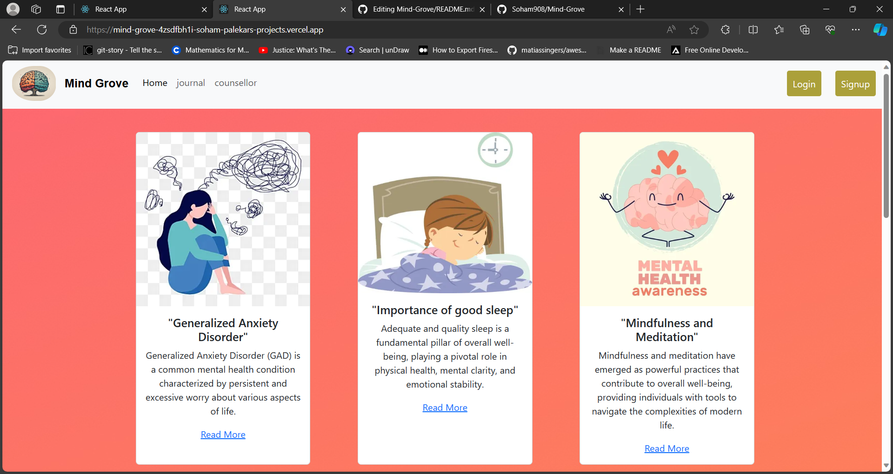
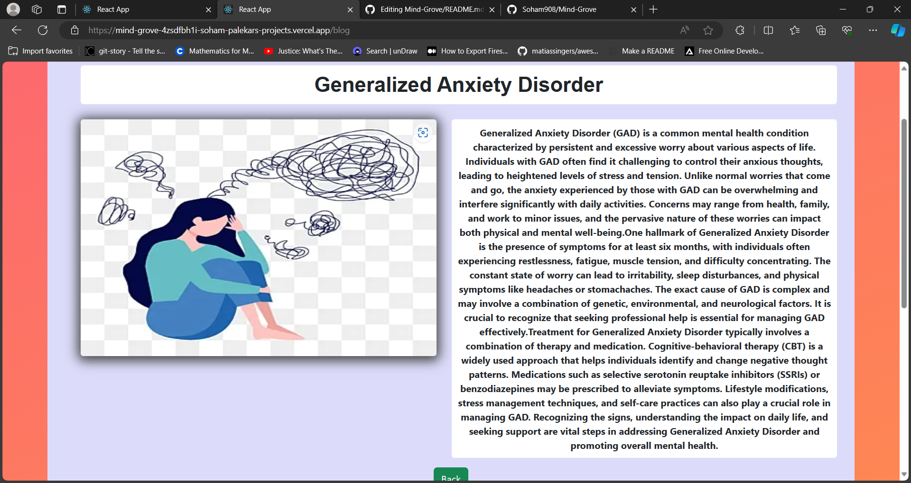
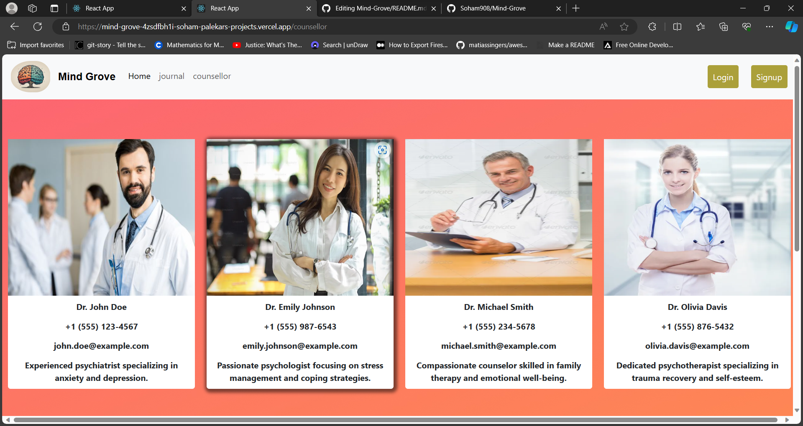
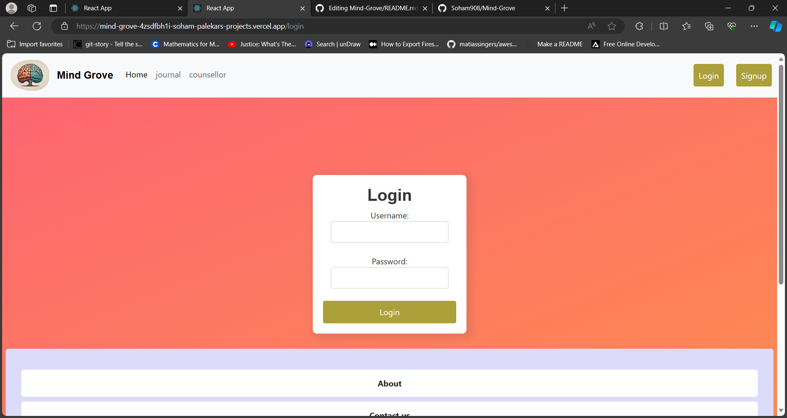

# Project Name

Brief project description and purpose.

## Table of Contents

- [Features](#features)
- [Installation](#installation)
- [Structure](#structure)
- [Dependencies](#dependencies)
- [Screenshots](#screenshots)
- [License](#license)

## Features

1. **Blogs and Articles:** Explore a collection of mental health-related articles and blogs.
2. **Counsellors:** Connect with certified mental health professionals for counseling.
3. **Authentication:** Secure user authentication with registration and login features.
4. **Journal:** Maintain a personal journal to track thoughts, feelings, and goals.


## Installation

Provide instructions on how to install and set up the project.

```bash
# Clone the repository
git clone https://github.com/Soham908/Mind-Grove.git

# Install dependencies
npm install

```

## Structure
project-root/
|-- src/
|   |-- components/
|   |   |-- Navbar/
|   |   |-- Blog/
|   |   |-- Footer/
|   |   |-- Card/
|   |
|   |-- data/
|   |   |-- articles.json
|   |   |-- doctorInfo.json
|   |
|   |-- images/
|   |   |-- (put your image files here)
|   |
|   |-- pages/
|       |-- Counsellor/
|       |-- Home/
|       |-- Journal/
|       |-- MoodTracker/
|
|-- App.js
|-- index.js
|-- (other project files)


## Dependencies

1. **React**: A JavaScript library for building user interfaces.
   - Package: `react`
   - Version: `^18.2.0`

2. **React Router DOM**: A library for handling routing in React applications.
   - Package: `react-router-dom`
   - Version: `^6.20.1`

3. **Axios**: A promise-based HTTP client for making requests to APIs.
   - Package: `axios`
   - Version: `^1.6.2`


## Screenshots







## License
This project is licensed under the MIT License - see the [LICENSE.md](LICENSE.md) file for details.


